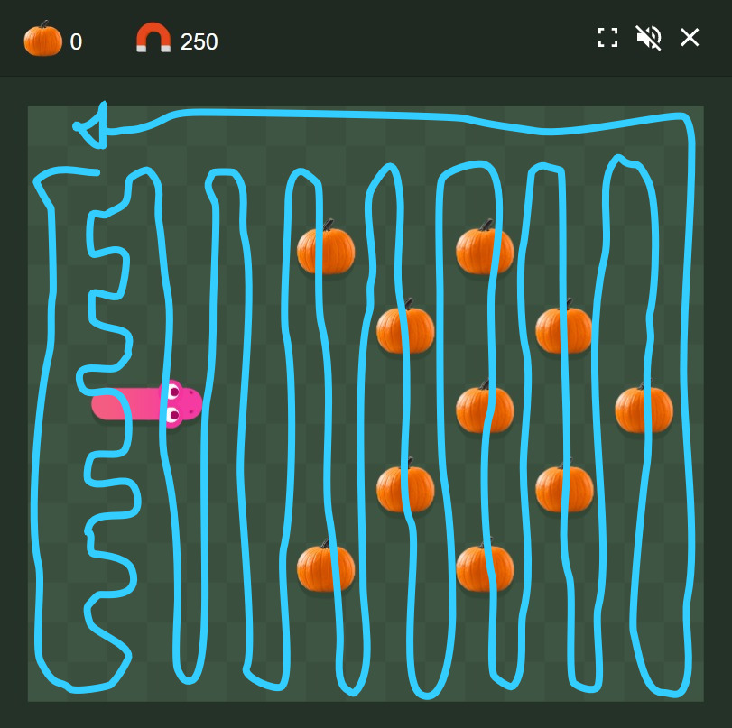

# Snake Game
This simple version of snake was made in an attempt to experiment a strategy on a odd sized snake grid. Since snake is such a simple game, I decided it would be worth it to make my own version of snake instead of modifying an existing one. The game itself took about an hour to make, another hour was spent testing, fixing and building the strategy.

## The game
The rules of snake considered for this game are:
1. There is an n x m sized grid of empty squares;
2. Around this grid there are walls;
3. There is a snake of initial size 1 that occupies a single square, this occupied square is its head;
4. The snake is moving in a certain direction at all times, moving its head to a different square;
5. Whenever the snake moves, it leaves a trail as long as its size, occupying squares with its body;
6. If the snake moves into a square occupied by a wall or it's body, the game is lost;
7. The snake can choose to change to any perpendicular direction to the current each frame;
8. The snake starts by looking left, up, right or down at a certain position in the map;
9. The snake's head and body move at the same time, meaning a 4 sized snake can't hit itself;
10. At every frame, if there isn't an apple in the map, there will be an attempt to create an apple;
11. An apple is created randomly on an empty square, this can fail if there are no empty squares;
12. If the head of the snake moves into a square occupied by an apple, the snake's size will increase by one;
13. If an apple fails at being created, the game is won.

## The problem
A friend of mine proposed: "I was trying to beat snake game on this map and I couldn't find any cycles. Then I found out that if the sides are of odd size, there is no cycle and no way to guarantee a victory. In grid graphs, if the grid has odd sized sides, there is no hamiltonian cycle".

I decided to try it anyway, since though I believed him that there was no hamiltonian cycle, I didn't believe there was no way to guarantee a victory.

## The solution
Promptly after his proposition, I came up with the following solution:

This is not a full hamiltonian cycle, since it would be impossible for it to be, but it was good enough to "guarantee a victory". The idea is to make a hamiltonian cycle that gathers all squares except one, in the top left, and switch from leaving the top left blank to leaving second row, second column square blank if an apple ever appeared in the top left.

### Why it works
Let this be a game on a 2x2 snake grid, where E is an empty space, A is an apple, H is the snake's Head and S is a part of the snake's body.
1. size: 1
    E A
    E H

2. size: 2
    A H
    E S

3. size: 3
    H S
    A S

4. size: 4
    S S
    H S

At this point, the game would end (see rule 13), and the player would win, but notice that the snake occupies 4 squares and if the game were to not end, the snake could keep spinning infinitly, since it can never catch it's tail (see rule 9):

5. size: 4
    S S
    S H

6. size: 4
    S H
    S S

...

This means that any hamiltonian cycle, if never broken, cannot possibly lead to a loss. So the idea is to make a hamiltonian cycle and swap it any time there is an apple at the remaining square for a different hamiltonian cycle of same size that starts and ends one to the side in the same direction.

## The code
The code is fully unoptimized, made as quickly as I could. This means the code is quite ugly and slow, but short and was quick to make. These are some interesting decisions:
- The grid is an int matrix that contains the snake's size at that point, as all non-zero squares get subtracted by 1 every frame if the snake has not eaten an apple;
- The snake's speed is controlled by the game's frame rate, meaning I can simulate it as quickly as I want it to but setting a high target frame rate;
- The strategy created for automating gameplay is a matrix of directions telling where the snake should go in each case, with a VOID direction that keeps going in the same direction;
- The walls were made by checking if the snake has moved out of bounds;
- The apples are positioned randomly, if the space is occupied, it tries again until it randomly finds an unoccupied position, which is extremely inefficient at the end game, but works;
- The squared is colored white if its grid value is not 0, red if there is an apple there, black otherwise.

